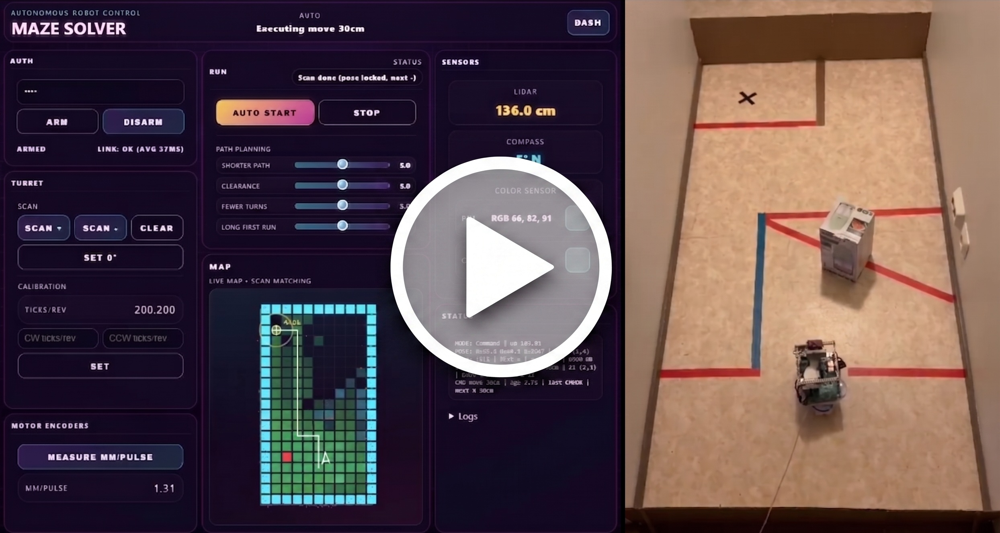
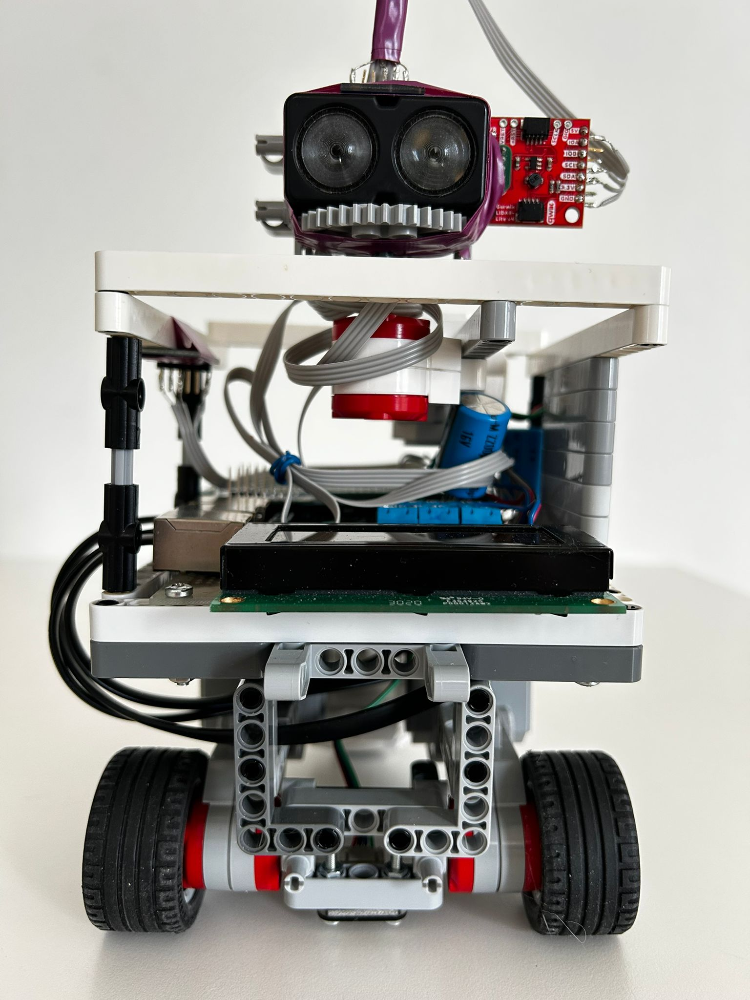
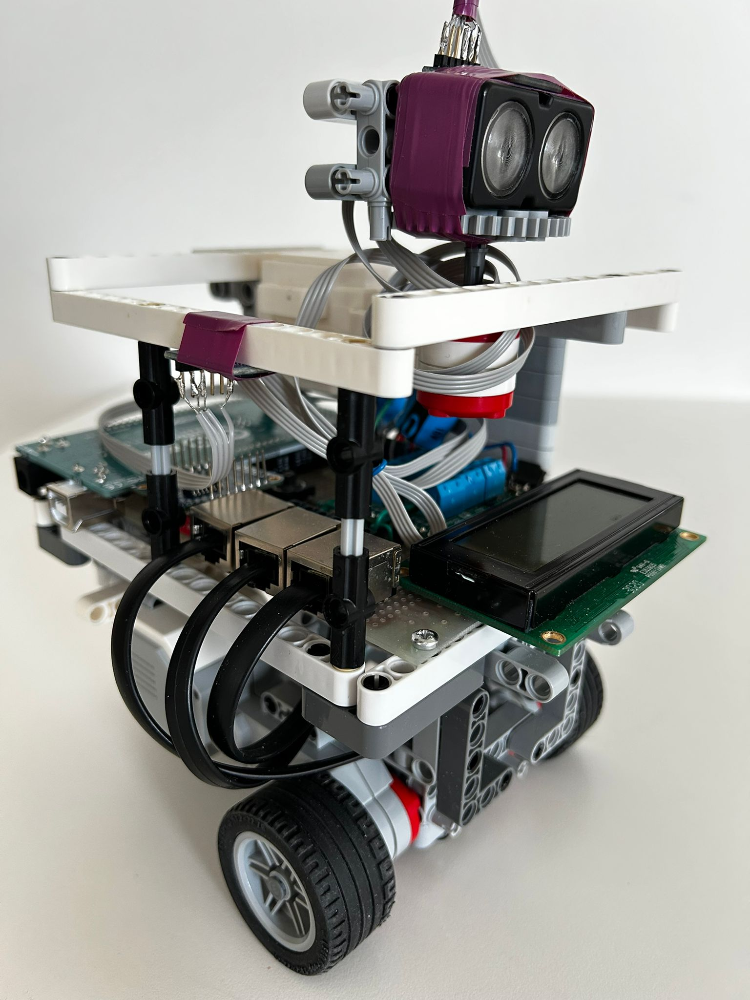
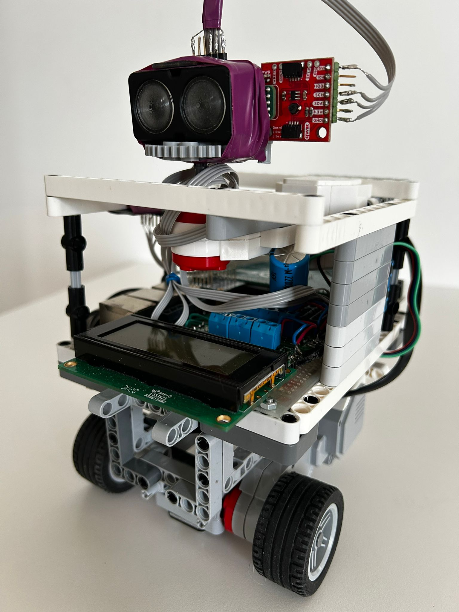
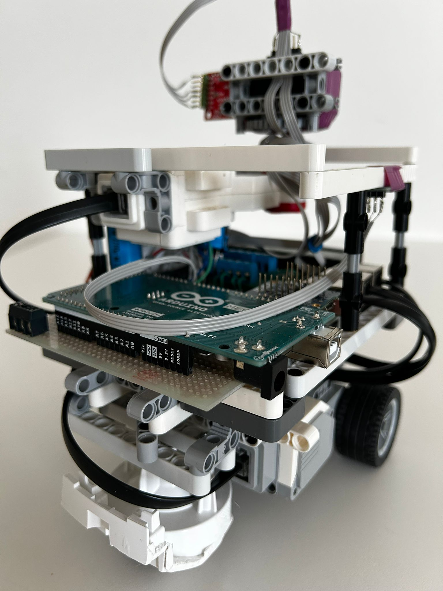
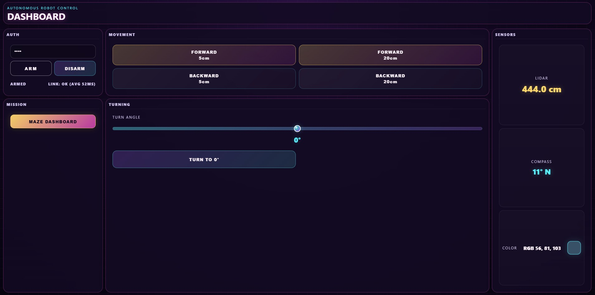
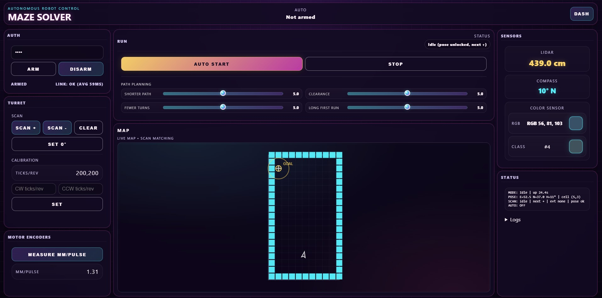
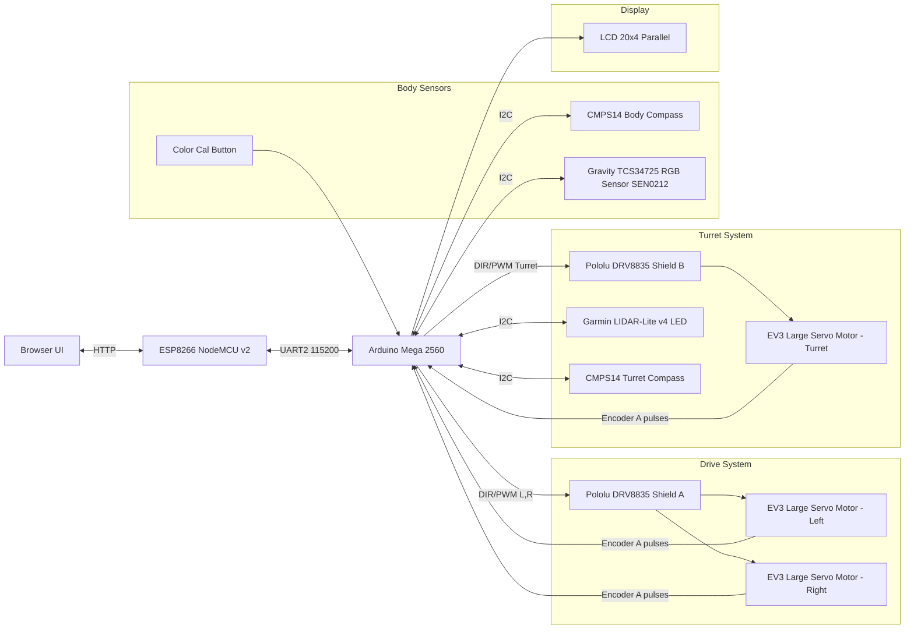

# WallNut

WallNut is an autonomous maze-solving robot engineered to work reliably with low-cost, noisy sensors rather than precision hardware. The system fuses wheel odometry, compass heading, color sensing, and LiDAR data, then actively corrects drift through repeated scan matching against a live map. A custom turret with motor encoder turns a 1D LiDAR into dense 2D environmental scans, enabling continuous relocalization during motion. This architecture is designed around real-world failure modes: odometry drift, heading bias, scan noise, and uncertain floor interaction. WallNut combines real-time mapping, scan-based pose correction, reflex safety stops, and multi-criteria path planning to navigate complex mazes and reach goals robustly, while a live dashboard exposes map state, planned path, obstacles, and telemetry throughout execution.

## Demo

<a href="https://youtu.be/Jd3l6BgcNAk">
  
</a>

Shows full autonomous maze solving with live dashboard visualization and robot motion side-by-side.

## Gallery

### Robot

<table>
  <tr>
    <td width="50%">
      <br/>
      Figure 1. Front view of WallNut.
    </td>
    <td width="50%">
      <br/>
      Figure 2. Front-right view of WallNut.
    </td>
  </tr>
  <tr>
    <td width="50%">
      <br/>
      Figure 3. Front-left view of WallNut.
    </td>
    <td width="50%">
      <br/>
      Figure 4. Rear-right view of WallNut.
    </td>
  </tr>
</table>

### UI

<table>
  <tr>
    <td>
      <br/>
      Figure 5. Main dashboard (<code>/</code>) showing authentication, manual control, and live telemetry.
    </td>
  </tr>
  <tr>
    <td style="padding-top:6px;">
      <br/>
      Figure 6. Maze dashboard (<code>/maze</code>) showing authentication, mapping, planning, autonomy state, telemetry, and calibration.
    </td>
  </tr>
</table>

## What WallNut Does

- Autonomous maze solving from start to goal.
- Live mapping with continuous localization correction.
- Goal-directed navigation using planned path execution.

## How It Works

- A rotating turret with a dedicated CMPS14 compass and a 1D LiDAR produces 2D environment scans; LiDAR sample angles are compass-referenced, and sweep completion in compass mode is accepted when either compass span or calibrated encoder-turn span is reached.
- In compass sweep mode, a single-step turret-compass jump over 10 degrees is ignored for stop-decision evaluation only.
- Scan matching is used to continuously correct localization drift.
- Sensor fusion combines scan matching with wheel odometry and compass heading.
- Multi-criteria path planning selects motion, then commands are executed step-by-step.

## Path Planning Optimization

- WallNut uses a weighted grid-based planner (A* variant) instead of a pure shortest-path policy.
- The planner optimizes four criteria together:
  - path length (`wLen`): prefers shorter overall paths.
  - turn penalty (`wTurn`): penalizes heading changes, favoring fewer/smaller turns.
  - obstacle/red-tile risk (`wRisk`): penalizes cells near walls/virtual red obstacles to prefer safer clearance.
  - longer first straight run from the robot (`wFirst`): rewards a longer initial straight segment before the first turn.
- UI sliders control intent weights, and code-level calibration gains (`kLen`, `kTurn`, `kRisk`, `kFirst`) normalize their practical effect in the cost equation.
- Risk is computed from distance-to-obstacle and distance-to-virtual-red sources, then merged conservatively to avoid unstable over-penalization.
- Execution is scan-driven and robust to drift: scan -> plan -> optional turn -> one bounded forward segment -> rescan -> replan.

## System Architecture

- **Arduino Mega**: real-time control loop, sensor handling, safety reflexes, and motion execution.
- **ESP8266**: web server hosting the UI, HTTP transport layer, and UART bridge to Mega.
- **Browser UI**: live mapping, path planning, and autonomy orchestration.

## Data and Event Communication

- **Mega -> ESP (UART):**
  - Sensor and telemetry packets (LiDAR, compass, odometry, color, calibration/status).
  - Scan stream (`TSCAN:BEGIN/SAMPLE/DONE/CANCEL`).
  - `TSCAN` sample angles are generated from turret-compass heading deltas (not encoder tick angle projection).
  - Motion and safety events (`EVT:CMDOK`, `CMDFAIL`, `CMDCANCEL`, `FRONTSTOP`, `RED`).

- **ESP -> Browser (HTTP):**
  - Snapshot telemetry via `/telemetry`.
  - Scan-event ring (`TSCAN:*`) via `/events?from=...`.
  - Alert/event ring (`EVT:*`) via `/alerts?from=...` and `/alerts_tail`.
  - Auth and link-age state (`auth`, `tries_left`, `mega_age_ms`) via `/auth_state`.

- **Browser -> ESP -> Mega (commands):**
  - Arming and disarming.
  - Motion commands (move/turn).
  - Scan triggers and scan control.
  - Pose alignment updates (`/set_pose`).

- **Why this matters:**
  - Telemetry powers live UI state.
  - Events and alerts drive autonomy transitions and safety recovery.
  - Sequence cursors prevent replay and keep browser autonomy synchronized with robot state.

## Autonomy Behavior Model

- Localization is scan-corrected, not odometry-only.
- After scan matching, browser waits for pose alignment (`/set_pose`) before planning.
- Runtime policy is intentional: scan -> plan -> optional turn -> bounded move -> rescan -> replan.
- Scan lifecycle is transactional: `TSCAN:BEGIN/SAMPLE/DONE/CANCEL` via `/events`.

## Environment Semantics and Tunables

- Physical obstacles come from LiDAR occupancy mapping.
- Calibrated color 1 (red floor marker) is treated as a virtual blocked cell for planning/safety logic.
- Calibrated color 2 (blue floor marker) increases forward speed by 50% from the default behavior.
- Virtual red obstacles are separate from LiDAR occupancy and can be inflated in planner space.
- Color meanings and reactions are tunable through calibration/configuration.

## Key Features

- Real-time map visualization.
- Planned path and obstacle visualization.
- Reflex safety stops.
- Arming/authentication flow for motion commands.
- Calibration tools for color sensor, wheel encoders, and turret.

## Hardware

- Arduino Mega 2560.
- ESP8266 (NodeMCU v2).
- Garmin LIDAR-Lite v4 LED (mounted on rotating turret).
- 2x CMPS14 tilt-compensated compass modules (body compass + turret compass).
- 2x Pololu DRV8835 Dual Motor Driver Shield for Arduino (one shield for the two drive motors, one shield for the turret motor).
- 3x LEGO MINDSTORMS EV3 Large Servo Motor (2 drive motors + 1 turret motor).
- Gravity: TCS34725 RGB Color Sensor for Arduino (SKU: SEN0212).
- Motor encoders are integrated in all LEGO MINDSTORMS EV3 Large Servo Motors (drive and turret).
- Custom rotating turret assembly for 1D LiDAR scanning.

## Hardware Schematic



### Mega Pin Map

| Function | Mega Pin(s) | Notes |
|---|---|---|
| Drive left motor DIR/PWM | D15 / D5 | DRV8835 shield A |
| Drive right motor DIR/PWM | D7 / D6 | DRV8835 shield A |
| Turret motor DIR/PWM | D14 / D4 | DRV8835 shield B |
| Left wheel encoder A | D2 (INT) | Rising edge count |
| Right wheel encoder A | D3 (INT) | Rising edge count |
| Turret encoder A | D18 (INT) | Rising edge count |
| Color calibration button | D19 (INT) | `INPUT_PULLUP`, falling edge |
| LCD RS/EN/D4/D5/D6/D7 | D22/D24/D26/D28/D30/D32 | 20x4 parallel LCD |
| Mega ↔ ESP UART2 | TX2 D16, RX2 D17 | 115200 baud |
| I2C bus | SDA D20, SCL D21 | Shared by LiDAR + compasses + color sensor |

### I2C Devices

| Device | Address |
|---|---|
| CMPS14 body compass | `0x60` |
| CMPS14 turret compass | `0x61` |
| TCS34725 color sensor | `0x29` |
| Garmin LIDAR-Lite v4 LED | `0x62` |

WallNut is intentionally built around low-cost, noisy, lab-grade sensors, with robustness achieved primarily through software and algorithm design.

## Software Stack

- PlatformIO with Arduino framework (Mega + ESP8266 firmware builds).
- ESP-hosted web UI using HTML, CSS, and JavaScript.
- Browser-side mapping, localization support, and path planning.

## Repository Structure

- `src/mega/` - Arduino Mega firmware (real-time control, sensing, safety, motion, tasks).
- `src/esp/` - ESP8266 firmware (Wi-Fi, HTTP routes, static file serving, UART transport).
- `data/esp/` - Web UI assets (dashboard pages, styles, browser-side mapping/autonomy code).
- `platformio.ini` - Main PlatformIO environments for Mega and ESP8266.
- `platformio_override.example.ini` - Example local override template.
- `src/mega/secrets.example.h` - Example local Mega secrets template.
- `src/esp/wifi_secrets.example.h` - Example local ESP Wi-Fi secrets template.

## Prerequisites

- PlatformIO CLI installed (`pio` command available).
- USB serial drivers for Arduino Mega and ESP8266 board.
- Physical robot hardware wired and powered.

## Build and Flash

```bash
# Flash Mega firmware
pio run -e megaatmega2560 -t upload

# Flash ESP8266 firmware
pio run -e esp8266 -t upload

# Upload web UI filesystem image (LittleFS) to ESP8266
pio run -e esp8266 -t uploadfs
```

### Build Only (No Flash)

```bash
# Build Mega firmware
pio run -e megaatmega2560

# Build ESP8266 firmware
pio run -e esp8266

# Build LittleFS image only
pio run -e esp8266 -t buildfs
```

Notes:
- Set local upload ports in `platformio_override.ini` (recommended) or directly in `platformio.ini`.
- Re-upload LittleFS (`uploadfs`) whenever web UI files under `data/esp/` change.

## Configuration

Create local (gitignored) config files:

- `src/esp/wifi_secrets.h` from `src/esp/wifi_secrets.example.h`
- `src/mega/secrets.h` from `src/mega/secrets.example.h`
- `platformio_override.ini` from `platformio_override.example.ini`

Important: keep all secrets and local machine settings out of git.

## Quick Start

1. Create local config files from templates:
   - `src/esp/wifi_secrets.h`
   - `src/mega/secrets.h`
   - `platformio_override.ini`
2. Build and flash ESP8266 firmware:
   - `pio run -e esp8266 -t upload`
3. Upload ESP8266 LittleFS UI image:
   - `pio run -e esp8266 -t uploadfs`
4. Build and flash Mega firmware:
   - `pio run -e megaatmega2560 -t upload`
5. Open the web UI (see network behavior below).
6. Use `/` for manual control and `/maze` for autonomous maze solving.

## Web UI

- `/` - Main dashboard for manual controls and live telemetry.
- `/maze` - Autonomy dashboard for scanning, mapping, planning, and run status.

## Default Network Behavior

- ESP8266 attempts STA connection first when Wi-Fi credentials are configured.
- If STA connection is unavailable, ESP8266 falls back to AP mode with SSID `WallNut`.
- Open the ESP IP in browser:
  - STA mode: use the router-assigned local IP.
  - AP mode: use the AP IP shown on the robot LCD.

## Safety and Constraints

- Arming is required before any motion command is accepted.
- Passcode failures are counted; repeated failures trigger a locked state.
- Locked/disarmed states block movement until the system is re-armed through the auth flow.
- Reflex safety can cancel active motion immediately:
  - `FRONTSTOP` on near-front obstacle condition.
  - `RED` on detected red-floor hazard condition.
- Reflex cancellation forces motor stop and emits event packets used by browser autonomy recovery logic.

## Calibration and Readiness

- Run color calibration, drive-motion calibration, and turret compass alignment checks before serious autonomy runs.
- Calibration quality directly affects classification, motion scale, and scan consistency.

## License

CC BY-NC 4.0 (non-commercial, source-available)
See [LICENSE](LICENSE) for full terms.
